# HAPS — Nodo Sensor y Enlace LoRa (STM32WL55)
### Sistema de Adquisición de Datos y Posicionamiento para Globo Estratosférico de Alta Altitud


Firmware del **nodo transmisor de telemetría** para HAPS (*High Altitude Platform System*), un proyecto de globo sonda estratosférico desarrollado en **CEGA Electrónica**. El nodo adquiere variables ambientales, inerciales y de posicionamiento durante el vuelo, las empaqueta en un protocolo binario propio y las transmite a una estación terrena mediante radiofrecuencia LoRa.

<p align="center">
  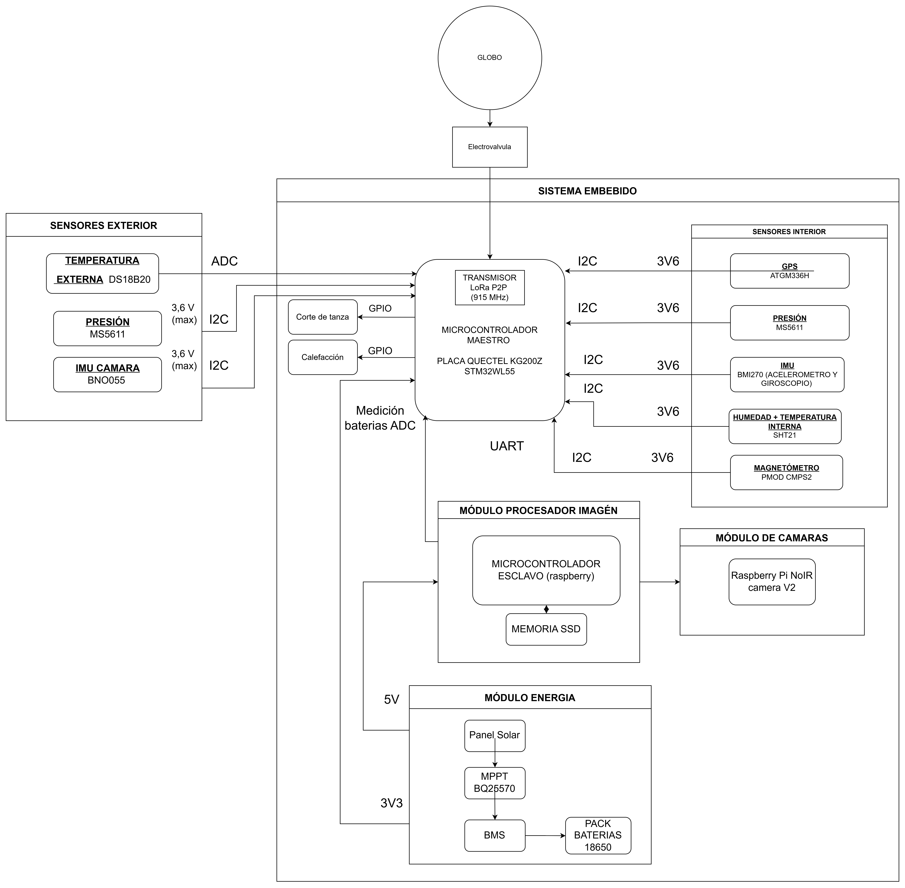
  <br>
  <em>Diagrama en bloques del sistema embebido</em>
</p>

> 📡 Este repositorio contiene el **segmento de vuelo (nodo transmisor)**. Para el comportamiento del receptor, ver el repositorio de la Estación Terrena.

---

## Tabla de contenidos

- [Arquitectura de hardware](#arquitectura-de-hardware)
- [Red de sensores (I2C)](#red-de-sensores-i2c)
- [Posicionamiento y depuración (UART)](#posicionamiento-y-depuración-uart)
- [Gestión de energía (ADC + 18650)](#gestión-de-energía-adc--18650)
- [Protocolo de comunicaciones — TLV](#protocolo-de-comunicaciones--tlv)
- [Enlace LoRa (Sub-GHz)](#enlace-lora-sub-ghz)
- [Arquitectura del firmware](#arquitectura-del-firmware)
- [Flujo de ejecución](#flujo-de-ejecución)
- [Diseño de PCB](#diseño-de-pcb)
- [Compilación y dependencias](#compilación-y-dependencias)
- [Estructura del repositorio](#estructura-del-repositorio)
- [Autores](#autores)

---

## Arquitectura de hardware

El sistema se organiza en cuatro subsistemas funcionales: **red de sensores**, **procesamiento**, **gestión de energía** y **actuadores/control**, todos gobernados por un microcontrolador de la familia **STM32WL55** (SoC con radio Sub-GHz integrada), montado sobre una placa de prueba **Quectel KG200Z**.

<p align="center">
  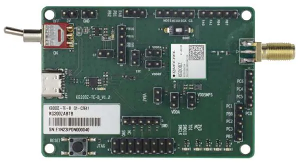
  <br>
  <em>Quectel KG200Z (STM32WL55C)</em>
</p>

Las comunicaciones físicas se distribuyen en tres interfaces:

| Interfaz | Uso |
|---|---|
| I2C3 | Sensórica ambiental e inercial |
| USART1 | Recepción GPS (tramas NMEA) |
| USART2 | Consola de depuración / telemetría ASCII |
| ADC (canal 4, PB1) | Monitoreo del banco de baterías |

---

## Red de sensores (I2C)

Todos los sensores comparten el bus **I2C3**, minimizando la cantidad de pines requeridos:

| Sensor | Función | Dirección | Detalle |
|---|---|---|---|
| **BMI270** | IMU 6 DoF (acel. + gyro) + temp. interna | `0x68` | Requiere carga de config. inicial (*burst write*) |
| **SHT20** | Humedad y temperatura ambiente | `0x40` | Interrogado cíclicamente |
| **MS5611** | Presión atmosférica absoluta y temperatura | — | Base del cálculo de altitud redundante |
| **CMPS2** | Magnetómetro / azimut respecto al norte magnético | — | Orientación 3D |

<p align="center">
  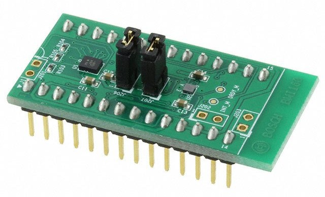
  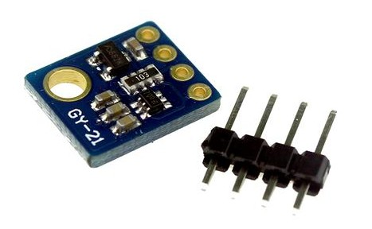
  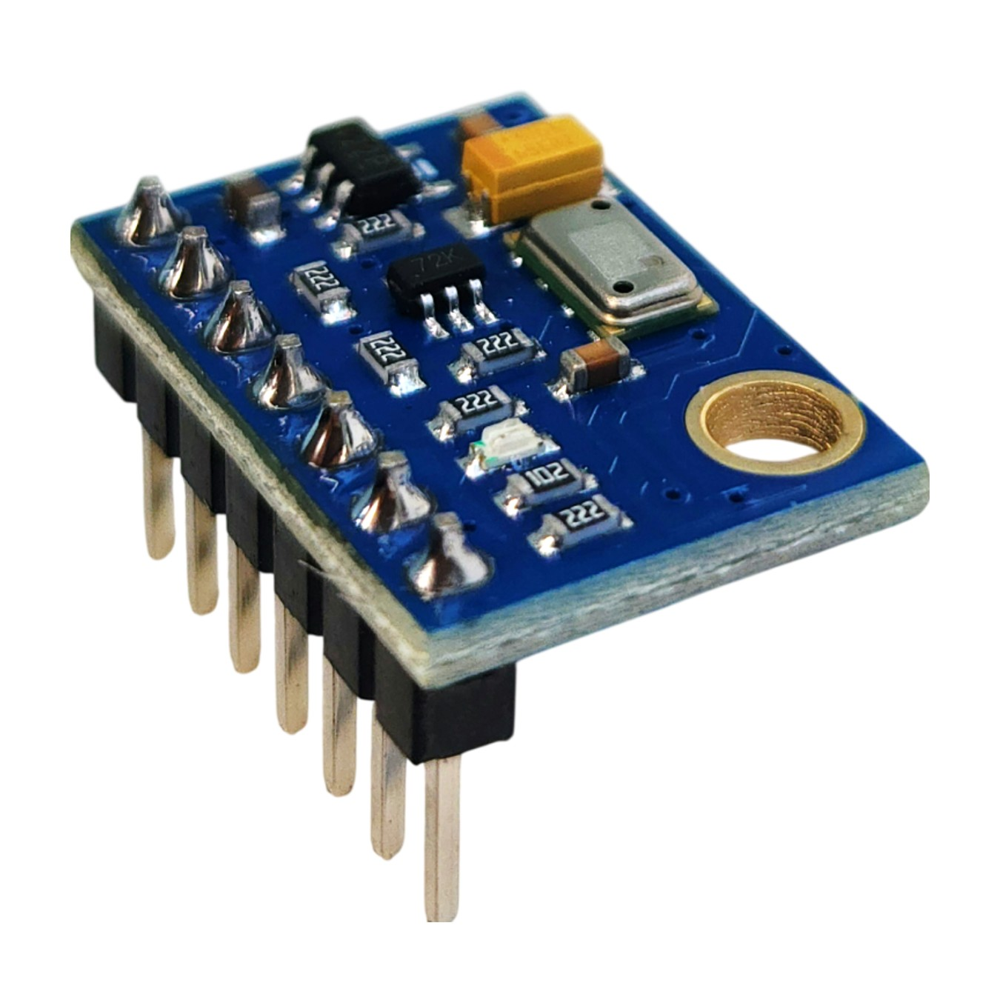
  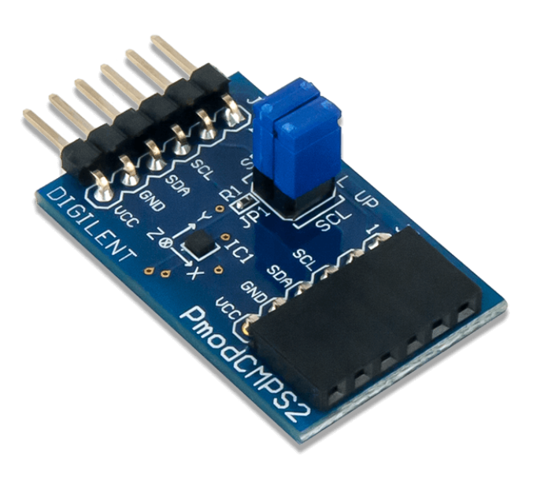
</p>

## Posicionamiento y depuración (UART)

- **GPS — USART1**: recepción de tramas NMEA por interrupciones de hardware (`HAL_UART_Receive_IT`) hacia un *ring buffer* de 512 bytes, evitando pérdida de caracteres. Un parser extrae hora, coordenadas, altitud y fijación de satélites (`GGA`) y velocidad (`VTG`).
- **Consola — USART2**: puerto de depuración con el log del sistema y volcado ASCII de los datos antes de su compresión y envío por RF.

<p align="center">
  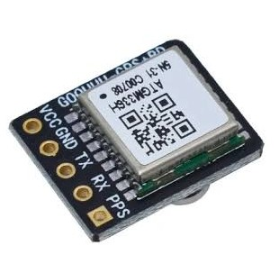
</p>

## Gestión de energía (ADC + 18650)

El banco de baterías se monitorea en el canal 4 del ADC (`PB1`). Como la tensión máxima de la celda Li-ion (4.2 V) supera la referencia de 3.3 V del MCU, la señal se acondiciona con un divisor resistivo ($R_1=100\,\text{k}\Omega$, $R_2=220\,\text{k}\Omega$). Para reducir ruido, la lectura aplica sobremuestreo (10 muestras) + filtro EMA ($\alpha=0.1$), interpolando el resultado en una tabla de descarga para estimar el **Estado de Carga (SoC)**.

Se utiliza una celda **18650 en configuración 1S** (3.0–4.2 V), simplificando el diseño frente a esquemas multi-celda. Dado que las celdas de litio pierden desempeño por debajo de 0 °C y pueden dañarse por debajo de -20 °C —condición habitual sobre los 30 km de altitud, con presiones menores a 1 kPa y temperaturas de hasta -70 °C—, el sistema incorpora una resistencia calefactora dentro de un encapsulado EPS de doble pared, junto con recirculación de aire para redistribuir el calor disipado por la electrónica.

<p align="center">
  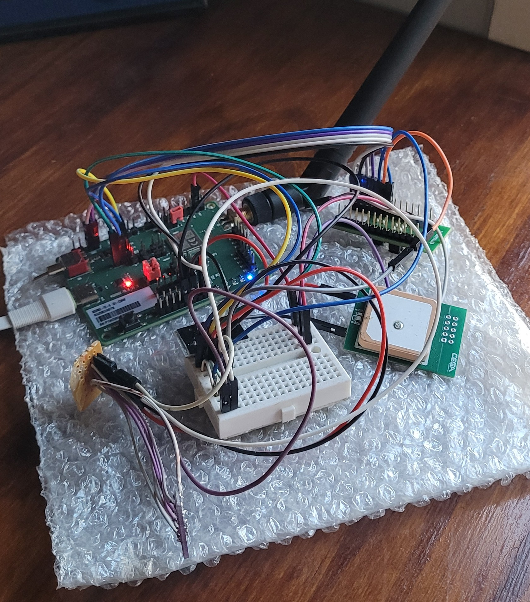
  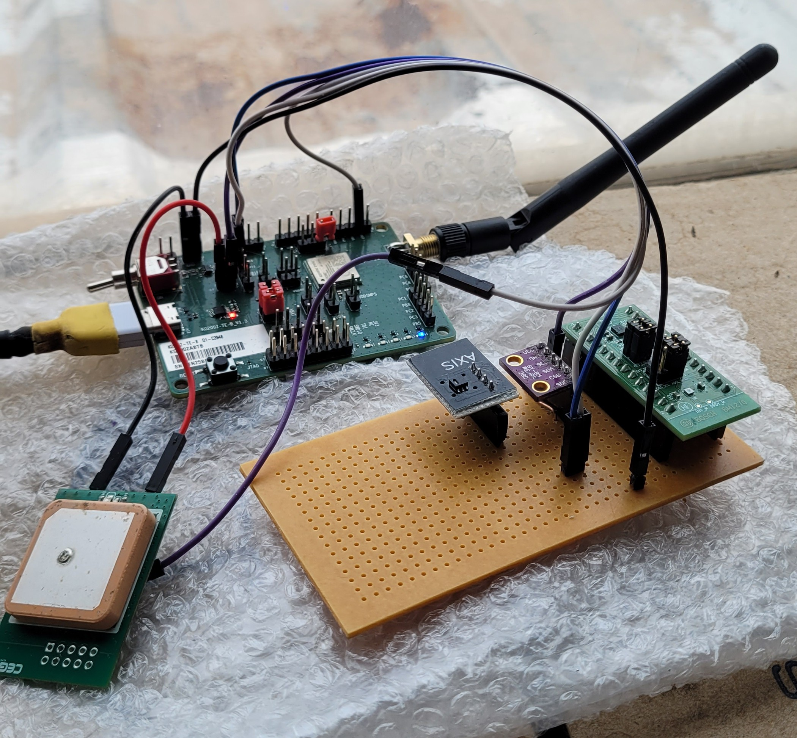
  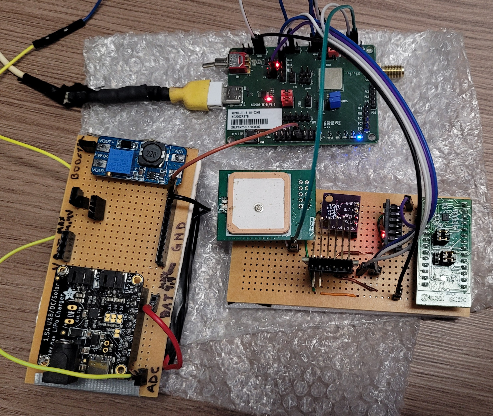
</p>

---

## Protocolo de comunicaciones — TLV

Para minimizar el *time-on-air* y el consumo, el firmware **no envía texto plano (ASCII/JSON)**. En su lugar arma un payload binario bajo el esquema **TLV (Type-Length-Value)**, empaquetando dinámicamente solo los datos válidos (por ejemplo, si el GPS aún no tiene *fix*, se omiten las coordenadas). Cada campo va en formato *Big-Endian* y se genera desde `build_telemetry_payload()`.

| Tag | Descripción | Longitud | Formato |
|---|---|---|---|
| `0x01` | Hora UTC (GPS) | 3 bytes | Horas, Minutos, Segundos |
| `0x02` | Coordenadas GPS | 8 bytes | Latitud y Longitud (`int32_t`) |
| `0x03` | Altitud GPS | 2 bytes | Metros sobre el nivel del mar |
| `0x04` | Velocidad de desplazamiento | 2 bytes | km/h × 100 |
| `0x05` | Aceleración (IMU) | 6 bytes | Ejes X, Y, Z (`int16_t`) |
| `0x06` | Giroscopio (IMU) | 6 bytes | Ejes X, Y, Z (`int16_t`) |
| `0x07` | Temperatura SHT20 | 2 bytes | °C × 100 |
| `0x08` | Humedad SHT20 | 2 bytes | % × 100 |
| `0x09` | Presión atmosférica (MS5611) | 4 bytes | mbar × 100 (`uint32_t`) |
| `0x0B` | Voltaje de batería | 2 bytes | mV (`uint16_t`) |
| `0x0C` | Estado de carga (SoC) | 1 byte | % (0–100) |
| `0x0D` | Azimut (magnetómetro) | 2 bytes | Grados × 100 |
| `0x0E` | Temperatura de batería (DS18B20) | 2 bytes | °C × 100 |
| `0x0F` | Estado del calefactor (*heater*) | 1 byte | Booleano |

El payload resultante es dinámico (típicamente 30–53 bytes).

---

## Enlace LoRa (Sub-GHz)

Gestionado a través del middleware **SubGHz_Phy** de ST, en enlace punto a punto (P2P):

| Parámetro | Valor |
|---|---|
| Frecuencia | 915 MHz (config. a 917.3 MHz para evitar solapamiento) |
| Bandwidth (BW) | 125 kHz |
| Spreading Factor (SF) | 7 (reconfigurable hasta SF12 vía *downlink*) |
| Potencia de salida | `TX_OUTPUT_POWER` (máxima permitida por hardware) |
| Ventana de escucha ACK | 3000 ms |

La transmisión es **no bloqueante**, ejecutada mediante una FSM controlada por el secuenciador de tareas `UTIL_SEQ`:

```c
case TX:
    if (tlv_ready && lora_tx_len > 0) {
        memcpy(BufferTx, lora_tx_buffer, lora_tx_len);
        Radio.Send(BufferTx, lora_tx_len);
        tlv_ready = 0; /* Buffer consumido */
    }
    break;
```

Al finalizar el envío, la interrupción `OnTxDone()` conmuta el estado a **RX** y abre la ventana de escucha del ACK de la estación terrena. Si se agota el timeout, se descarta el paquete y se retorna al ciclo nominal.

---

## Arquitectura del firmware

Modelo **productor-consumidor** sincronizado, pensado para evitar condiciones de carrera y *HardFaults* en el bus SPI interno de la radio:

- **Adquisición de datos (`main.c`)** — el GPS se lee en segundo plano vía interrupciones circulares; el muestreo I2C está gobernado por temporizadores no bloqueantes (`HAL_GetTick()`) con un *watchdog* lógico que garantiza el envío de datos aun sin *fix* satelital.
- **Sincronización (`lora_busy`)** — semáforo lógico: mientras la radio transmite o espera un ACK, el *loop* principal congela la lectura I2C y la actualización del buffer TX, protegiendo la integridad de la trama en curso.
- **Máquina de estados de radio (`subghz_phy_app.c`)** — corre exclusivamente vía `UTIL_SEQ`. Las interrupciones de hardware (`OnTxDone`, `OnRxTimeout`) son mínimas: solo cambian el estado lógico y ceden el control al secuenciador, manteniendo el procesador libre y el bus SPI seguro.

## Flujo de ejecución

1. El sistema adquiere datos de los sensores e interroga al GPS.
2. Si la radio está libre (`lora_busy == 0`), se construye el paquete TLV y se imprime el log ASCII por UART de debug.
3. Se cierra el candado lógico y se encola la tarea `PingPong_Process` en el secuenciador.
4. La radio transmite el paquete y pasa automáticamente a modo RX para escuchar el ACK.
5. **ACK recibido** → se libera el candado y se espera al siguiente ciclo de sensores.
6. **Timeout** → se descarta el paquete, se alerta por consola (*"Master Alerta: Sin respuesta"*), se libera el candado y se toman datos frescos del GPS/IMU para el siguiente intento (evitando reenviar telemetría desactualizada).

---
## Output de consola

En la consola de depuración (USART2) siempre se pueden visualizar los datos empaquetados en TLV, pero además el sistema muestra tres salidas distintas según el estado del GPS.

### GPS buscando satélites

Es el caso más común apenas arranca el sistema, mientras el receptor todavía no logró fijar posición:

<p align="center">
  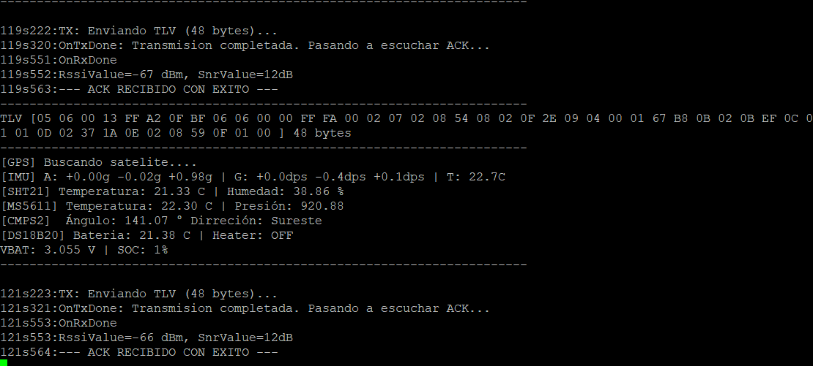
  <br>
  <em>GPS buscando satélite</em>
</p>

### GPS desconectado

Se da cuando el módulo GPS está desconectado. El firmware usa `HAL_GetTick()` para determinar el último *fix* válido e imprime en consola el estado correspondiente:

<p align="center">
  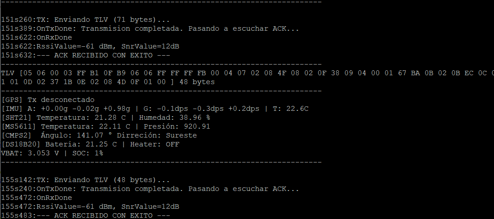
  <br>
  <em>GPS desconectado</em>
</p>

### Geolocalización encontrada

Con *fix* satelital, la consola muestra las variables entregadas por el módulo GPS: Latitud, Longitud, Altitud, Velocidad, Hora, entre otras:

<p align="center">
  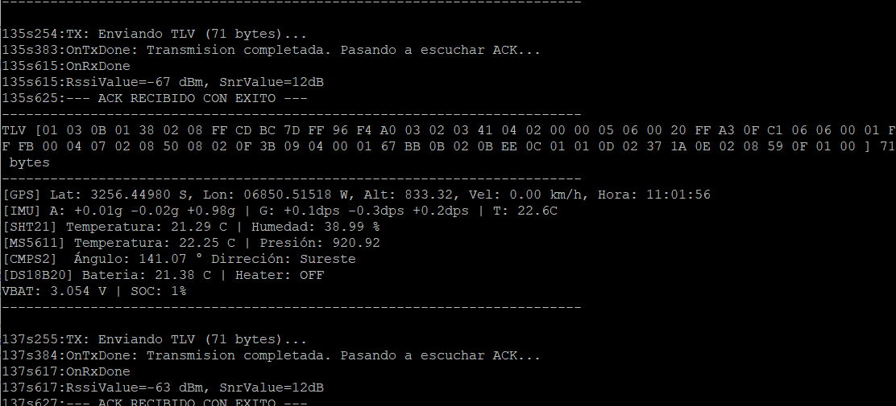
  <br>
  <em>Geolocalización</em>
</p>


## Diseño de PCB

Se desarrolló una PCB a medida en **KiCad**, orientada a minimizar peso, optimizar el factor de forma de la carga útil y eliminar cableado propenso a errores. El diseño es **modular** (para integrar los sensores ya validados) y de **dos capas**: plano de masa/alimentación en la capa superior, y ruteo de señal de alta velocidad + bus I2C en la capa inferior. Los módulos LoRa/GPS se ubicaron alejados del conversor DC-DC (MPPT, BQ25570) para minimizar interferencia electromagnética.

<p align="center">
  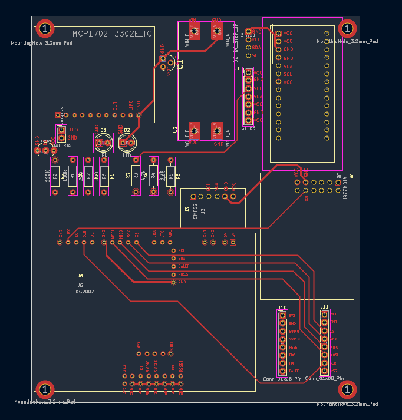
  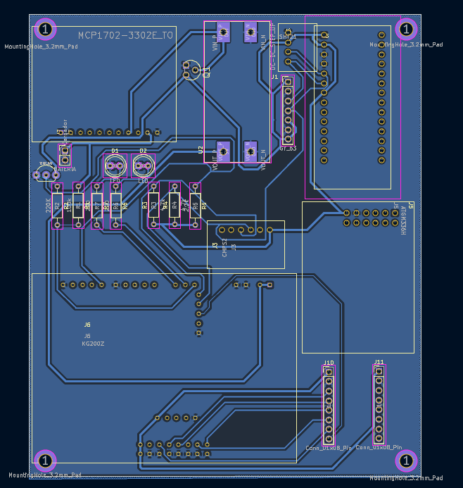
  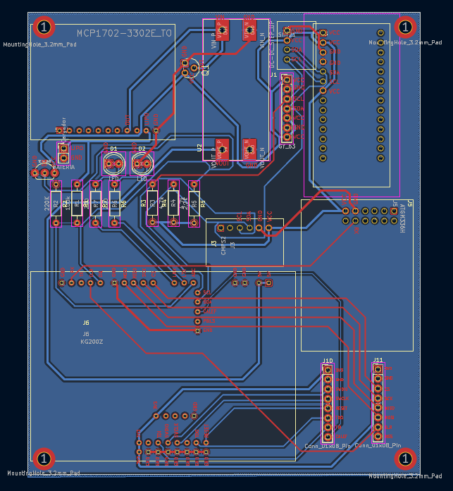
</p>
<p align="center">
  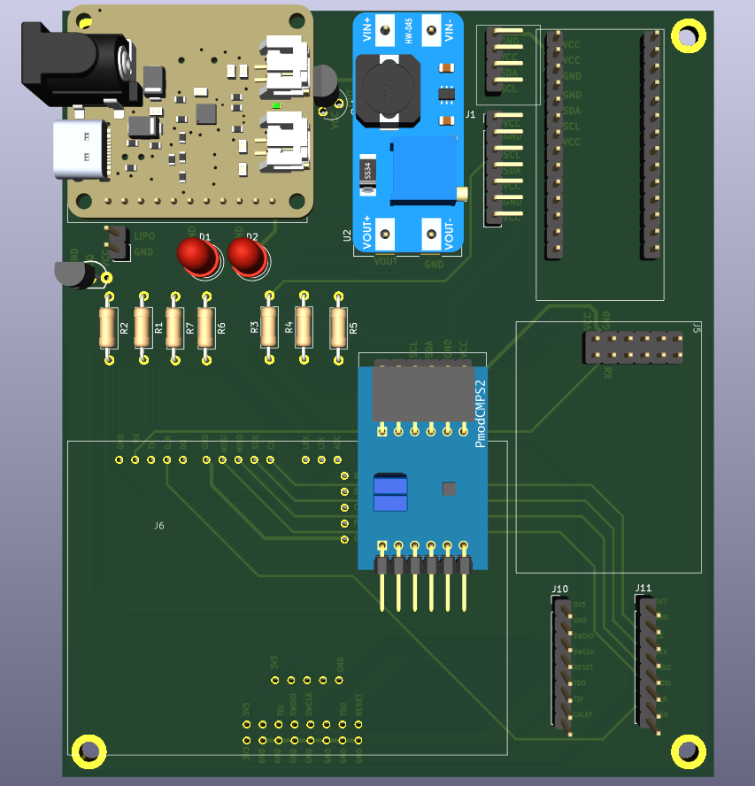
  
</p>

---

## Compilación y dependencias

- **IDE:** STM32CubeIDE
- **Paquete MCU:** STM32Cube MCU Package para la serie STM32WL
- **Middleware:** `SubGHz_Phy` (STMicroelectronics)

```bash
git clone https://github.com/francojsantander22-afk/lora_tx_sensores.git
```
Abrir el proyecto en STM32CubeIDE (`.project` / `.cproject`) y compilar normalmente. El archivo `LoRa_TX.ioc` contiene la configuración de periféricos generada por CubeMX.

## Estructura del repositorio

```
lora_tx_sensores/
├── Core/                          # Código de aplicación (main.c, drivers de sensores, HAL config)
├── Drivers/                       # HAL/CMSIS de STM32
├── Middlewares/Third_Party/SubGHz_Phy/
├── SubGHz_Phy/                    # App de radio (subghz_phy_app.c) y FSM
├── Utilities/                     # Secuenciador UTIL_SEQ y utilidades de ST
├── LoRa_TX.ioc                    # Configuración CubeMX
├── STM32WLE5CCUX_FLASH.ld         # Linker script
└── images/                        # Fotos y diagramas usados en este README
```

---

## Autores

**Franco Santander** · **Lisandro Elmelaj** — CEGA Electrónica, proyecto HAPS (High Altitude Platform System)

> 📎 Nota: agregar las imágenes referenciadas (`diagrama.png`, `kg200z.png`, `bmi270.jpg`, `sht20.jpg`, `ms5611.jpg`, `cmps2.png`, `atgm336h.jpg`, fotos de prototipo, `top.png`/`bottom.png`/`topbottom.png`, `3dz.png`/`3dzback.png`) dentro de una carpeta `images/` en la raíz del repo — son las mismas que ya tenés preparadas para el informe en LaTeX.
